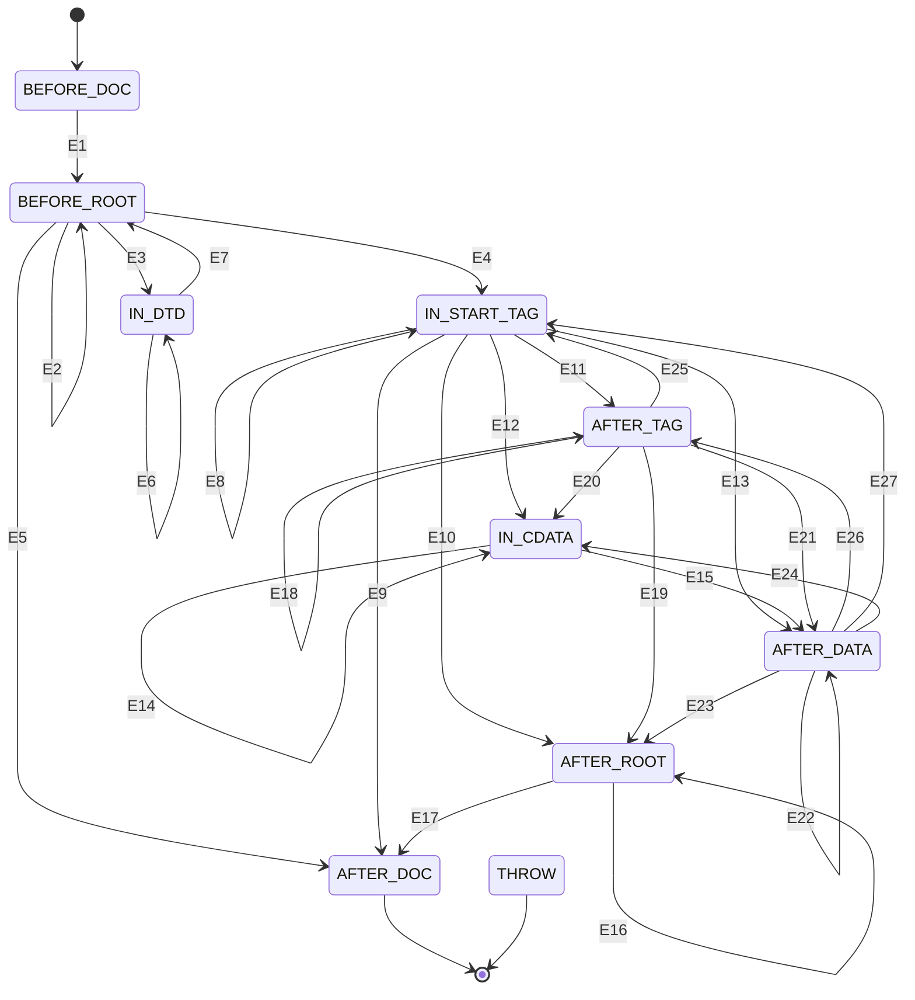

# XmlWriter Formatting State Machine

## Overview
This document describes the state machine at the core of the XmlWriter class.

## State Diagram

## State Transitions

#### Current State: BEFORE_DOC
| Event          | Event ID | Action           | Next State  |
|----------------|----------|------------------|-------------|
| ATTRIBUTE      |          |                  | THROW       |
| BLOCK_REF      |          |                  | THROW       |
| CHARACTERS     |          |                  | THROW       |
| COMMENT        |          |                  | THROW       |
| END_CDATA      |          |                  | THROW       |
| END_DOCUMENT   |          |                  | THROW       |
| END_DTD        |          |                  | THROW       |
| END_ELEMENT    |          |                  | THROW       |
| INLINE_REF     |          |                  | THROW       |
| NEWLINE        |          |                  | THROW       |
| PI             |          |                  | THROW       |
| START_CDATA    |          |                  | THROW       |
| START_DOCUMENT | E1       | Write XML prolog | BEFORE_ROOT |
| START_DTD      |          |                  | THROW       |
| START_ELEMENT  |          |                  | THROW       |

#### Current State: BEFORE_ROOT
| Event          | Event ID | Action                    | Next State   |
|----------------|----------|---------------------------|--------------|
| ATTRIBUTE      |          |                           | THROW        |
| BLOCK_REF      | E2       | Write ref                 | BEFORE_ROOT  |
| CHARACTERS     | E2       | Write characters          | BEFORE_ROOT  |
| COMMENT        | E2       | Write comment             | BEFORE_ROOT  |
| END_CDATA      |          |                           | THROW        |
| END_DOCUMENT   | E5       | Cleanup                   | AFTER_DOC    |
| END_DTD        |          |                           | THROW        |
| END_ELEMENT    |          |                           | THROW        |
| INLINE_REF     | E2       | Write ref                 | BEFORE_ROOT  |
| NEWLINE        | E2       | Write newline             | BEFORE_ROOT  |
| PI             | E2       | Write PI                  | BEFORE_ROOT  |
| START_CDATA    |          |                           | THROW        |
| START_DOCUMENT |          |                           | THROW        |
| START_DTD      | E3       | Write doctype             | IN_DTD       |
| START_ELEMENT  | E4       | Push new element on stack | IN_START_TAG |

#### Current State: IN_START_TAG
| Event          | Event ID | Action                                | Next State                                        |
|----------------|----------|---------------------------------------|---------------------------------------------------|
| ATTRIBUTE      | E8       | Add attribute to top element          | IN_START_TAG                                      |
| BLOCK_REF      | E11      | Write top element, write ref          | AFTER_TAG                                         |
| CHARACTERS     | E13      | Write top element, write characters   | AFTER_DATA                                        |
| COMMENT        | E11      | Write top element, write comment      | AFTER_TAG                                         |
| END_CDATA      |          |                                       | THROW                                             |
| END_DOCUMENT   | E9       | Write top element, cleanup            | AFTER_DOC                                         |
| END_DTD        |          |                                       | THROW                                             |
| END_ELEMENT    | E10 E11  | Write top element (minimize_, pop)    | AFTER_TAG (level > 0) AFTER_ROOT (level == 0) |
| INLINE_REF     | E13      | Write top element, write ref          | AFTER_DATA                                        |
| NEWLINE        | E11      | Write top element, write newline      | AFTER_TAG                                         |
| PI             | E11      | Write top element, write PI           | AFTER_TAG                                         |
| START_CDATA    | E12      | Write top element, open CDATA section | IN_CDATA                                          |
| START_DOCUMENT |          |                                       | THROW                                             |
| START_DTD      |          |                                       | THROW                                             |
| START_ELEMENT  | E8       | Write top element, push new element   | IN_START_TAG                                      |

#### Current State: IN_CDATA
| Event          | Event ID | Action                            | Next State |
|----------------|----------|-----------------------------------|------------|
| ATTRIBUTE      |          |                                   | THROW      |
| BLOCK_REF      | E14      |  Write ref                        | IN_CDATA   |
| CHARACTERS     | E14      |  Write characters - do not escape | IN_CDATA   |
| COMMENT        | E14      |  Write comment                    | IN_CDATA   |
| END_CDATA      | E15      |  Close CDATA section              | AFTER_DATA |
| END_DOCUMENT   |          |                                   | THROW      |
| END_DTD        |          |                                   | THROW      |
| END_ELEMENT    |          |                                   | THROW      |
| INLINE_REF     | E14      |  Write ref                        | IN_CDATA   |
| NEWLINE        | E14      |  Write newline                    | IN_CDATA   |
| PI             |          |                                   | THROW      |
| START_CDATA    |          |                                   | THROW      |
| START_DOCUMENT |          |                                   | THROW      |
| START_DTD      |          |                                   | THROW      |
| START_ELEMENT  |          |                                   | THROW      |

#### Current State: IN_DTD
| Event          | Event ID | Action            | Next State  |
|----------------|----------|-------------------|-------------|
| ATTRIBUTE      |          |                   | THROW       |
| BLOCK_REF      |          |                   | THROW       |
| CHARACTERS     | E6       |  Write characters | IN_DTD      |
| COMMENT        | E6       |  Write comment    | IN_DTD      |
| END_CDATA      |          |                   | THROW       |
| END_DOCUMENT   |          |                   | THROW       |
| END_DTD        | E7       |  No op            | BEFORE_ROOT |
| END_ELEMENT    |          |                   | THROW       |
| INLINE_REF     |          |                   | THROW       |
| NEWLINE        | E6       |  Write newline    | IN_DTD      |
| PI             |          |                   | THROW       |
| START_CDATA    |          |                   | THROW       |
| START_DOCUMENT |          |                   | THROW       |
| START_DTD      |          |                   | THROW       |
| START_ELEMENT  |          |                   | THROW       |

#### Current State: AFTER_TAG
| Event          | Event ID | Action              | Next State                                        |
|----------------|----------|---------------------|---------------------------------------------------|
| ATTRIBUTE      |          |                     | THROW                                             |
| BLOCK_REF      | E18      |  Write ref          | AFTER_TAG                                         |
| CHARACTERS     | E21      |  Write characters   | AFTER_DATA                                        |
| COMMENT        | E18      |  Write comment      | AFTER_TAG                                         |
| END_CDATA      |          |                     | THROW                                             |
| END_DOCUMENT   |          |  Cleanup            | THROW                                             |
| END_DTD        |          |                     | THROW                                             |
| END_ELEMENT    | E18 E19  |  Write end tag, pop | AFTER_TAG (level > 0) AFTER_ROOT (level == 0) |
| INLINE_REF     | E21      |  Write ref          | AFTER_DATA                                        |
| NEWLINE        | E18      |  Write newline      | AFTER_TAG                                         |
| PI             | E18      |  Write PI           | AFTER_TAG                                         |
| START_CDATA    | E20      |  Open CDATA section | IN_CDATA                                          |
| START_DOCUMENT |          |                     | THROW                                             |
| START_DTD      |          |                     | THROW                                             |
| START_ELEMENT  | E25      |  Push new element   | IN_START_TAG                                      |

#### Current State: AFTER_DATA
| Event          | Event ID | Action             | Next State                                        |
|----------------|----------|--------------------|---------------------------------------------------|
| ATTRIBUTE      |          |                    | THROW                                             |
| BLOCK_REF      | E22      | Write ref          | AFTER_DATA                                        |
| CHARACTERS     | E22      | Write characters   | AFTER_DATA                                        |
| COMMENT        | E22      | Write comment      | AFTER_DATA                                        |
| END_CDATA      |          |                    | THROW                                             |
| END_DOCUMENT   |          | Cleanup            | THROW                                             |
| END_DTD        |          |                    | THROW                                             |
| END_ELEMENT    | E26 E23  | Write end tag, pop | AFTER_TAG (level > 0) AFTER_ROOT (level == 0) |
| INLINE_REF     | E22      | Write ref          | AFTER_DATA                                        |
| NEWLINE        | E22      | Write newline      | AFTER_DATA                                        |
| PI             | E22      | Write PI           | AFTER_DATA                                        |
| START_CDATA    | E24      | Open CDATA section | IN_CDATA                                          |
| START_DOCUMENT |          |                    | THROW                                             |
| START_DTD      |          |                    | THROW                                             |
| START_ELEMENT  | E27      | Push new element   | IN_START_TAG                                      |

#### Current State: AFTER_ROOT
| Event          | Event ID | Action           | Next State |
|----------------|----------|------------------|------------|
| ATTRIBUTE      |          |                  | THROW      |
| BLOCK_REF      | E16      | Write ref        | AFTER_ROOT |
| CHARACTERS     | E16      | Write characters | AFTER_ROOT |
| COMMENT        | E16      | Write comment    | AFTER_ROOT |
| END_CDATA      |          |                  | THROW      |
| END_DOCUMENT   | E17      | Cleanup          | AFTER_DOC  |
| END_DTD        |          |                  | THROW      |
| END_ELEMENT    |          |                  | THROW      |
| INLINE_REF     | E16      | Write ref        | AFTER_ROOT |
| NEWLINE        | E16      | Write newline    | AFTER_ROOT |
| PI             | E16      | Write PI         | AFTER_ROOT |
| START_CDATA    |          |                  | THROW      |
| START_DOCUMENT |          |                  | THROW      |
| START_DTD      |          |                  | THROW      |
| START_ELEMENT  |          |                  | THROW      |

#### Current State: AFTER_DOC
| Event           | Event ID | Action | Next State  |
|-----------------|----------|--------|-------------|
| ATTRIBUTE       |          |        | THROW       |
| BLOCK_REF       |          |        | THROW       |
| CHARACTERS      |          |        | THROW       |
| COMMENT         |          |        | THROW       |
| END_CDATA       |          |        | THROW       |
| END_DOCUMENT    |          |        | THROW       |
| END_DTD         |          |        | THROW       |
| END_ELEMENT     |          |        | THROW       |
| INLINE_REF      |          |        | THROW       |
| NEWLINE         |          |        | THROW       |
| PI              |          |        | THROW       |
| START_CDATA     |          |        | THROW       |
| START_DOCUMENT  |          |        | THROW       |
| START_DTD       |          |        | THROW       |
| START_ELEMENT   |          |        | THROW       |
